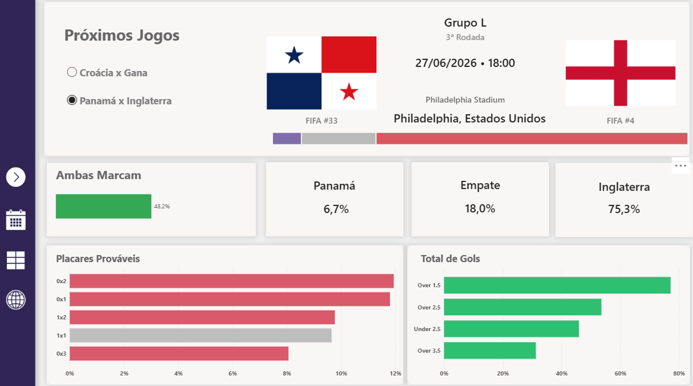
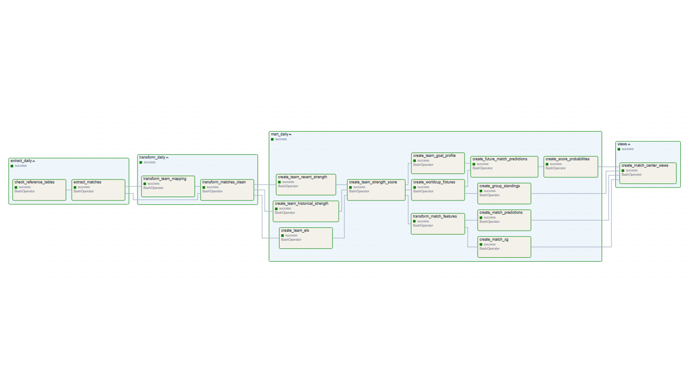
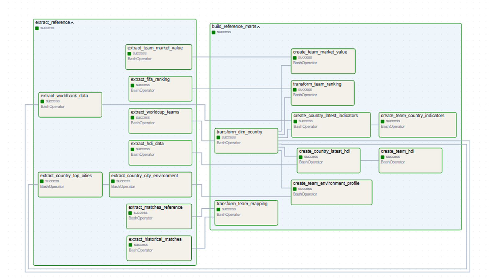
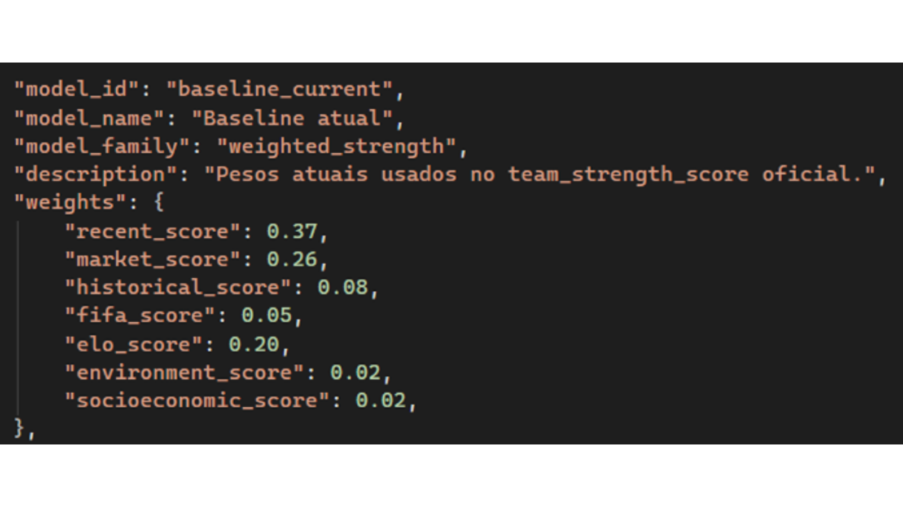
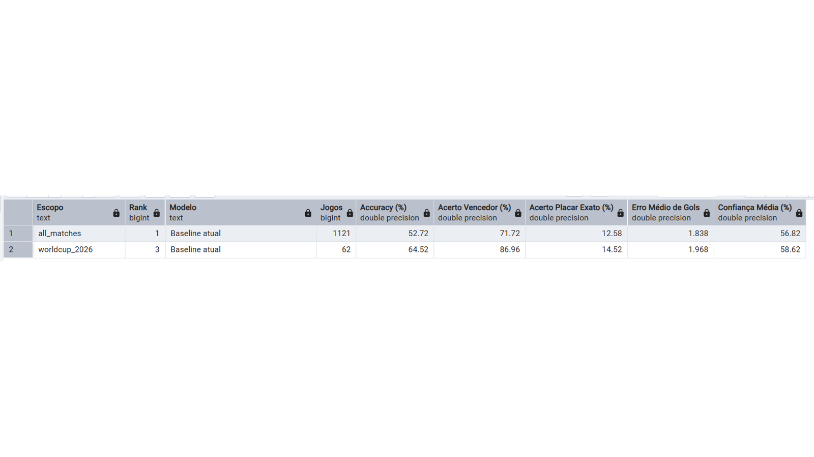

# WCStats

Pipeline de dados e dashboard analitico para acompanhar jogos da Copa do Mundo FIFA 2026. O projeto extrai dados publicos, organiza tudo em PostgreSQL, calcula indicadores de forca das equipes, gera previsoes de partidas e entrega views prontas para consumo no Power BI.



## Visao Geral

O WCStats centraliza informacoes de jogos, rankings, valor de mercado, historico recente, indicadores socioeconomicos e contexto ambiental em uma base unica. A partir dessa base, o projeto calcula probabilidades de resultado, placares provaveis, gols esperados e standings de grupos.

Principais entregas:

- Pipeline ELT em Python, PostgreSQL e Apache Airflow.
- Camadas de dados em `raw`, `staging`, `mart` e `experiments`.
- Views finais para o dashboard de proximos jogos e probabilidades.
- Arquivo Power BI (`WCStats.pbix`) para visualizacao interativa.
- Laboratorio de modelos para comparar pesos e estrategias de previsao.

## Stack

- Python
- PostgreSQL
- Apache Airflow
- Docker Compose
- Pandas, NumPy, SciPy e SQLAlchemy
- BeautifulSoup/lxml para scraping
- Power BI

## Arquitetura

```text
fontes publicas
      |
      v
src/01_extract  ->  raw
      |
      v
src/02_transform  ->  staging
      |
      v
src/03_mart  ->  mart
      |
      v
src/04_views  ->  views para Power BI

src/05_experiments -> experiments
```

Camadas do banco:

- `raw`: dados brutos vindos das fontes externas.
- `staging`: dados limpos, normalizados e mapeados.
- `mart`: tabelas finais de analise, features, rankings e previsoes.
- `experiments`: camada isolada para backtests e comparacao de modelos.

## Pipelines no Airflow

O projeto possui fluxos separados para referencias, atualizacao diaria e experimentos.





DAGs principais:

- `wcstats_reference_pipeline`: carga manual de dados pesados ou quase estaticos, como participantes, ranking FIFA, HDI, World Bank, valor de mercado e dados ambientais.
- `wcstats_pipeline`: pipeline diaria para atualizar jogos, recalcular forca das equipes, previsoes, probabilidades, standings e views finais.
- `wcstats_experiments_pipeline`: pipeline manual para backtests e comparacao de modelos no schema `experiments`.

Ordem recomendada:

1. Execute `wcstats_reference_pipeline` uma vez para preparar as tabelas de referencia.
2. Execute ou ative `wcstats_pipeline` para manter os dados atualizados.
3. Execute `wcstats_experiments_pipeline` quando quiser estudar novos pesos e modelos.

## Estrutura do Projeto

```text
WCStats/
  dags/
    wcstats_pipeline_dag.py
    wcstats_experiments_dag.py
  src/
    01_extract/
    02_transform/
    03_mart/
    04_views/
    05_experiments/
    config.py
    check_reference_tables.py
  docker-compose.yml
  requirements.txt
  .env.example
  WCStats.pbix
```

## Fontes de Dados

O projeto combina diferentes fontes publicas:

- OpenFootball World Cup JSON
- World Bank API
- Our World in Data HDI
- Transfermarkt
- GeoNames
- Open-Meteo
- Ranking FIFA via scraping

## Views Para o Power BI

As principais views consumidas pelo dashboard sao:

- `mart.vw_match_center`: base principal do painel de proximos jogos.
- `mart.vw_next_match`: proximas partidas selecionaveis para cards.
- `mart.vw_next_match_score_probabilities`: probabilidades de placares para os proximos jogos.
- `mart.vw_team_power_ranking`: ranking analitico disponivel no mart, usado como base de forca das equipes.

## Modelo de Previsao

O modelo principal combina sinais de:

- Ranking FIFA
- Elo
- desempenho recente
- historico das equipes
- valor de mercado
- perfil de gols
- indicadores socioeconomicos
- contexto ambiental

As previsoes geradas incluem:

- probabilidade de vitoria do mandante
- probabilidade de empate
- probabilidade de vitoria do visitante
- gols esperados
- placares mais provaveis
- over/under gols
- ambas marcam

## Laboratorio de Modelos

O script `src/05_experiments/create_prediction_model_lab.py` cria uma camada separada para avaliar modelos sem alterar o pipeline oficial.

Exemplo dos pesos do baseline:



Exemplo de resultado de avaliacao:



Ele gera:

- `experiments.model_candidates`
- `experiments.model_match_predictions`
- `experiments.model_evaluation_summary`
- `experiments.model_ablation_summary`
- `experiments.vw_all_prediction_models`
- `experiments.vw_best_prediction_models`
- `experiments.vw_model_component_weights`
- `experiments.vw_socio_environment_impact`
- `experiments.vw_worldcup_model_results`

Metricas acompanhadas:

- acerto de resultado 1X2
- acerto sem empates
- acerto de placar
- log loss
- erro medio de gols
- impacto dos sinais socioeconomicos e ambientais

## Como Rodar Localmente

Crie um arquivo `.env` a partir do exemplo:

```powershell
copy .env.example .env
```

Configure as credenciais do PostgreSQL:

```env
DB_USER=postgres
DB_PASSWORD=postgres
DB_HOST=localhost
AIRFLOW_DB_HOST=host.docker.internal
DB_PORT=5432
DB_NAME=wcstats
```

Suba a inicializacao do Airflow:

```powershell
docker compose up airflow-init
```

Suba webserver e scheduler:

```powershell
docker compose up airflow-webserver airflow-scheduler
```

Acesse o Airflow em:

```text
http://localhost:8080
```

Credenciais padrao locais:

```text
admin / admin
```

## Rodando Scripts Manualmente

Tambem e possivel executar scripts diretamente, desde que o `.env` esteja configurado:

```powershell
python src/01_extract/extract_matches.py
python src/02_transform/transform_matches_clean.py
python src/03_mart/create_team_strength_score.py
python src/04_views/create_match_center_views.py
```

Para rodar o laboratorio de modelos:

```powershell
python src/05_experiments/create_prediction_model_lab.py
```

## Dashboard

O arquivo principal do Power BI e:

```text
WCStats.pbix
```

O dashboard atual e focado em proximos jogos, probabilidades, placares provaveis e totais de gols. A pagina dedicada a selecoes/ranking ainda nao faz parte desta versao publica do projeto.

## Observacoes de Uso

- O projeto foi pensado para ambiente local/dev.
- O arquivo `.env` nao deve ser versionado.
- Dados temporarios e extracoes locais devem ficar fora do Git quando possivel.
- Para producao, o ideal e criar uma imagem customizada do Airflow com dependencias pre-instaladas e usar secrets para credenciais.

## Licenca

Este repositorio usa dados publicos de terceiros. Verifique os termos de uso das fontes antes de redistribuir bases processadas ou dashboards derivados.
